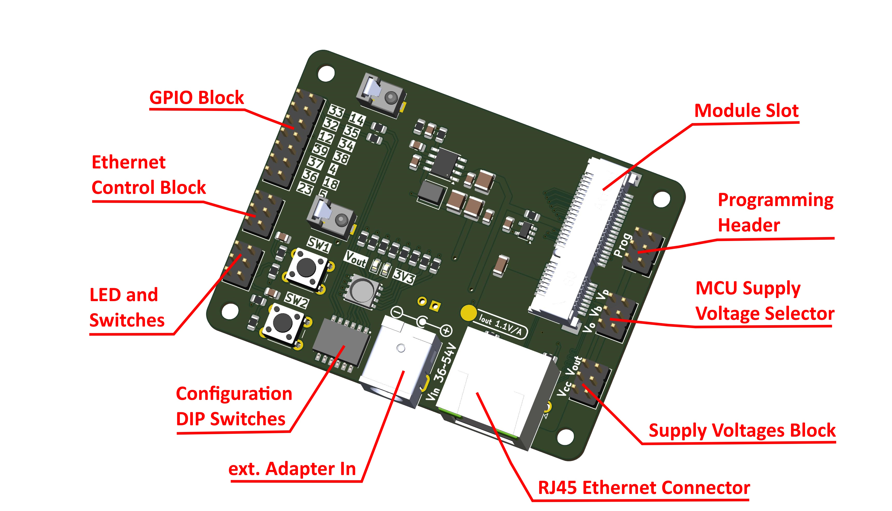

# Overview

The **Breakout Board** carrier is designed to let developers explore the full feature set of the openPoeNode module before committing to a custom carrier design. It includes a range of practical features to simplify testing, evaluation, and firmware debugging.

# Features

The Breakout Board provides a single slot for an openPoeNode module with any supported output voltage. An onboard DC/DC converter is included to step down 5V module output to 3.3V for MCU supply.

## Supply Voltage Selector

The MCU section can be powered from one of three sources:

- Module Vout directly (for 3.3V modules)
- Vbuck – output of the onboard DC/DC converter (Vout → 3.3V)
- Vprog – supplied by an external programmer or debugger

Select the desired source by placing a jumper cap on the corresponding pins.

Although the module includes overvoltage protection, avoid supplying 5V directly to the MCU section.

When powering the board via an external programmer, ensure it can provide sufficient current. Insufficient current may cause unstable behavior during programming (e.g., flash writes failing due to brownouts). If this occurs, use an external power adapter and select Vbuck as the supply source.

## Programming Header

Connector for an external programmer or debugger. The pinout matches the ESP-Prog board from Espressif.

## GPIO Block

All module GPIOs are broken out to this header for general-purpose use. Pin numbering follows the ESP32-D0WD-V3 datasheet.

## Ethernet Control Block

Three GPIOs are required to control the Ethernet interface (**GPIO2 / GPIO13 / GPIO15**). These are routed next to the corresponding **MDC / MDIO / Enable** pins.

- For normal operation, place jumper caps across each row to bridge the signals.
- For testing alternative pin assignments, the signals can be rerouted to other GPIOs using jumper wires.

## LED and Switches

The Breakout Board includes two tactile switches and one RGBW LED for quick testing.

### Switches

- Integrated pull-ups and hardware debouncing
- Output is pulled low when pressed

### LED

- Each channel’s anode is connected to 3.3V via a current-limiting resistor
- Cathodes are exposed on the header and can be driven by open-collector GPIOs

## Configuration DIP Switches

A 6-position DIP switch enables convenient hardware configuration during development:

- **I²C pull-ups (GPIO32 / GPIO33)**
  - 2.2 kΩ pull-ups for easy interfacing with I²C devices
  - Enable with Switch 1 & 2

- **Power load resistors**
  - 100 Ω and 56 Ω resistors from Vout to GND
  - Useful when very low power consumption causes PoE instability (minimum draw > 0.44 W)
  - Helps prevent PoE power cycling (“hiccup” behavior)
  - Enable individually with Switch 3 & 4

- **Power indicators**
  - LEDs for Vout and 3.3V rails
  - Enable/disable with Switch 5 & 6 (useful for precise power measurements)

## External Power Adapter

If PoE is unavailable or needs to be overridden, the board can be powered using an external 36–54V DC source.

- Connector: 5.5 × 2.1 mm barrel jack
- Polarity: center positive

## Supply Voltage Block

Provides power outputs for external devices (e.g., sensors):

- Vout (1x)
- 3.3V (2x)
- Digital GND (3x)

Ensure total consumption remains within the DC/DC converter limits:
- 5V module: up to 1.4A
- 3.3V module: up to 2.1A

## PoE Voltage Block

For advanced use cases, raw PoE input voltage is available for external DC/DC converters.

⚠️ This connector is not populated by default and should be used with caution.

## Supply Current Monitoring

An onboard current monitor IC helps track power consumption and stay within PoE and DC/DC converter limits (0.44W < P < 7W).

- Measures Iout via a 22 mΩ shunt resistor
- Measure voltage at the test pad (relative to digital ground)
- Current (A) = measured voltage / 1.1

# Physical

- Dimensions: 74 × 55 mm
- PCB: 4-layer FR4, 1.60 mm thickness

